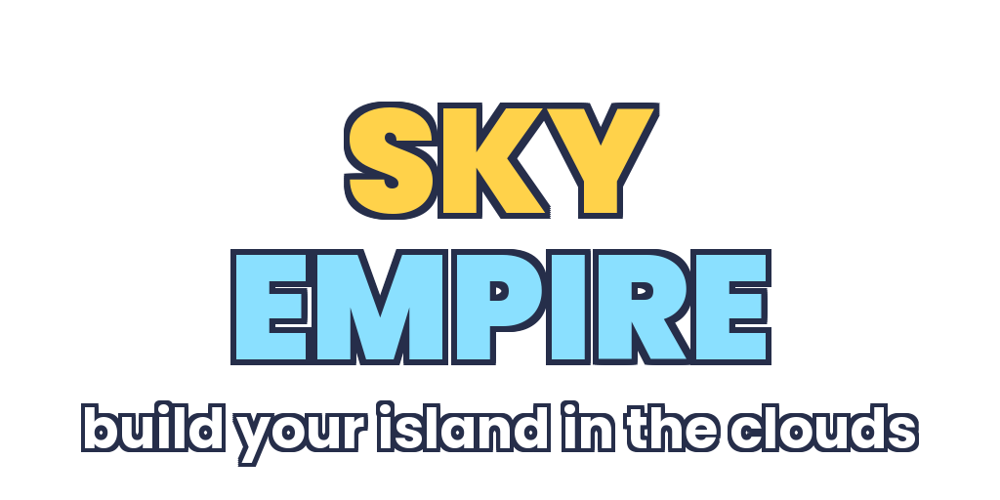

# Sky Empire

**Build your island in the clouds.** A multiplayer plot-ownership tycoon for s&box:
every player gets their own floating island in a shared sky ring and builds it from
one free dropper into a four-story orb factory — then rebirths and does it again,
faster, under a brand-new sky.

## The loop

1. **Step on green pads** to buy machines — no menus for the core loop.
2. **Droppers** spawn value orbs onto a conveyor. **Upgrader arches** multiply every
   orb that rolls under them. The **furnace** turns orbs into cash.
3. **Floors** (Storm Deck → Aurora Spire → Cosmic Crown) gate bigger machines and
   visibly grow your tower.
4. **Rebirth** resets the island for **+50% income forever** and re-skins your whole
   plot (Meadow → Sunset → Storm → Aurora → Cosmic → Golden) so progress is visible
   from across the sky.

## Why it retains

- **Idle-friendly**: orbs keep flowing while you stand around; offline pay at 50%
  for up to 8 hours makes the return-visit login a payday.
- **Playtime chests** every 8 minutes directly reward session length.
- **Golden orbs** (1-in-70, ×20 value, gem drops) are the variable-ratio hook;
  charms let players buy better odds.
- **Daily quests + login streak** pay gems; gems buy **Overdrive** (×2, 10 min) and
  **Orb Frenzy** (×3 dropper speed) — convenience, not power creep.
- **Social gravity**: standing on a friend's island gives **both** players +25%
  income, so lobbies idle together instead of alone.
- **Milestone chain** (10 steps) walks new players from the free pad to first
  rebirth with burst rewards at each step.

## Architecture

| Piece | File | Notes |
|---|---|---|
| Tuning | `Code/Core/Balance.cs` | every number in one place |
| Purchase catalog | `Code/Data/Purchases.cs` | the whole tycoon is data: 34 purchases, 4 floors, rebirth tiers |
| Shared world | `Code/World/WorldBuilder.cs` | hub + 12 plots + bridges + clouds, built deterministically on every client |
| Island renderer | `Code/Plot/PlotVisual.cs` | belt/droppers/arches/decor + local orb sim + walk-on buy pads |
| Player | `Code/Player/TycoonPlayer.cs` | networked movement; syncs purchase csv + rebirths so everyone sees every island |
| Progression | `Code/Progression/*` | local save (FileSystem.Data), milestones, dailies, offline pay |
| Lobby/UI state | `Code/Core/TycoonGame.cs` | plot assignment, friend boost, menu state |
| UI | `Code/UI/Hud.razor`, `Code/UI/MenuPanel.razor` | HUD, welcome/offline popup, boosts/rebirth/daily menu |

Progression is fully client-local (each player grinds their own save); only plot
index, purchase set, rebirth count, and session earnings are synced, so the game
scales to a full lobby with almost no network traffic.

## Dev

- Open `sky_empire.sbproj` in the s&box editor; the startup scene is
  `Assets/scenes/sky_isles.scene`. The world builds itself at runtime.
- Compile check: `dotnet build Code/sky_empire.csproj`.
- Regenerate art/sound: `python tools/generate_assets.py` (needs Pillow).
